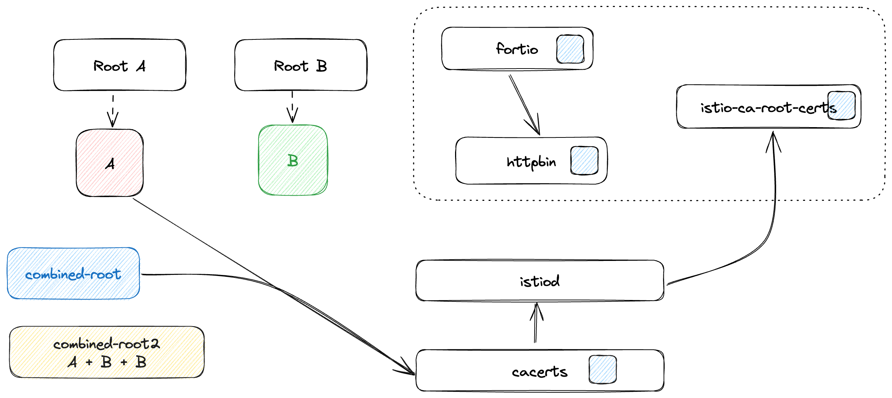
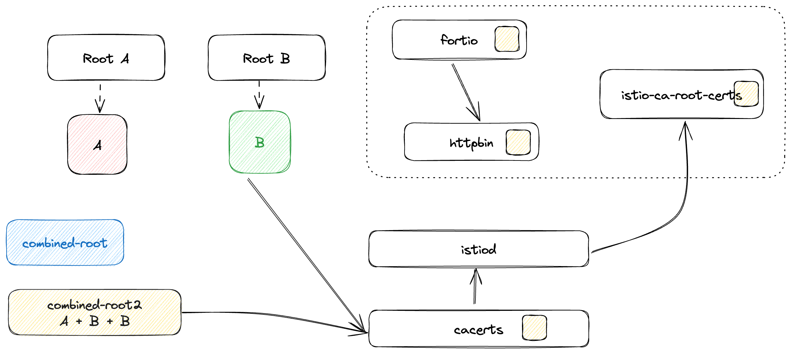

# Better Root Cert Rotation

## Prerequisites

- [istioctl](https://istio.io/latest/docs/setup/install/istioctl/)
- [step cli](https://smallstep.com/docs/step-cli/#introduction-to-step): an easy-to-use CLI tool for building, operating, and automating Public Key Infrastructure (PKI) systems and workflows.

## Generate Root Certs

1. Generate Root Certs A

   ```bash
   make -f Makefile.selfsigned.mk root-ca
   make -f Makefile.selfsigned.mk intermediateA-cacerts

   mkdir rootA

   mv root-* rootA
   mv intermediateA rootA
   ```

2. Create Root Certs B

   ```bash
   make -f Makefile.selfsigned.mk root-ca
   make -f Makefile.selfsigned.mk intermediateB-cacerts

   mkdir rootB

   mv root-* rootB
   rm -rf rootB/intermediateB
   mv intermediateB rootB
   ```

3. Combine root certs (`A+B`) into `combined-root.pem`

   ```bash
   cat rootA/root-cert.pem > combined-root.pem
   cat rootB/root-cert.pem >> combined-root.pem
   ```

4. Combine root certs (`A+B+B`) into `combined-root2.pem`

   ```bash
   cat rootA/root-cert.pem > combined-root2.pem
   cat rootB/root-cert.pem >> combined-root2.pem
   cat rootB/root-cert.pem >> combined-root2.pem
   ```

## Installing Istio with RootA

1. Create cacerts in `istio-system` namespace

   ```bash
   kubectl create ns istio-system
   ```

   ```bash
   kubectl delete secret cacerts -n istio-system --ignore-not-found && \
   kubectl create secret generic cacerts -n istio-system \
       --from-file=rootA/intermediateA/ca-cert.pem \
       --from-file=rootA/intermediateA/ca-key.pem \
       --from-file=rootA/intermediateA/root-cert.pem \
       --from-file=rootA/intermediateA/cert-chain.pem
   ```

   ```shell
   kubectl get secret cacerts -n istio-system -o jsonpath="{.data['root-cert\.pem']}" | step base64 -d | step certificate inspect --short -
   ```

2. Install istio with `ISTIO_MULTIROOT_MESH` with `PROXY_CONFIG_XDS_AGENT` enabled

   

   ```bash
   cat <<EOF | istioctl install -y -f -
   apiVersion: install.istio.io/v1alpha1
   kind: IstioOperator
   spec:
     meshConfig:
       accessLogFile: /dev/stdout
       defaultConfig:
         proxyMetadata:
           PROXY_CONFIG_XDS_AGENT: "true"
     values:
       pilot:
         env:
           ISTIO_MULTIROOT_MESH: "true"
   EOF
   ```

   ```
   # verify ca root cert
   kubectl get cm istio-ca-root-cert -o jsonpath="{.data['root-cert\.pem']}" | step certificate inspect --short -
   ```

   ```console
   X.509v3 Root CA Certificate (RSA 4096) [Serial: 2299...6364]
     Subject:     Root CA
     Issuer:      Root CA
     Valid from:  2024-03-10T15:16:40Z
             to:  2034-03-08T15:16:40Z
   ```

   ```shell
   kubectl label ns default istio-injection=enabled --overwrite
   kubectl apply -f manifests.yaml
   kubectl apply -f fortio.yaml
   ```

   Check the cert(serial number and valid time):

   ```shell
   istioctl pc s $(kubectl get pod -l app=fortio -o jsonpath={.items..metadata.name}) -ojson | jq -r ".dynamicActiveSecrets[0].secret.tlsCertificate.certificateChain.inlineBytes" | base64 -d | step certificate inspect - --short
   ```

   Workload cert:

   ```
   X.509v3 TLS Certificate (RSA 2048) [Serial: 3029...4552]
    Subject:     spiffe://cluster.local/ns/default/sa/default
    Issuer:      Intermediate CA
    Valid from:  2024-03-15T04:23:12Z
            to:  2024-03-16T04:25:12Z
   ```

   ```shell
   istioctl pc s $(kubectl get pod -l app=fortio -o jsonpath={.items..metadata.name}) -ojson | jq -r ".dynamicActiveSecrets[1].secret.validationContext.trustedCa.inlineBytes" | base64 -d | step certificate inspect - --short
   ```

   You should only see metrics where `response.code` is 200

   ```shell
   istioctl x es $(kubectl get pod -l app=fortio -o jsonpath={.items..metadata.name}) -oprom | grep istio_requests_total
   ```

   ```console
   # TYPE istio_requests_total counter
   istio_requests_total{reporter="source",source_workload="fortio-deploy",source_canonical_service="fortio",source_canonical_revision="latest",source_workload_namespace="default",source_principal="spiffe://cluster.local/ns/default/sa/default",source_app="fortio",source_version="",source_cluster="Kubernetes",destination_workload="httpbin",destination_workload_namespace="default",destination_principal="spiffe://cluster.local/ns/default/sa/httpbin",destination_app="httpbin",destination_version="v1",destination_service="httpbin.default.svc.cluster.local",destination_canonical_service="httpbin",destination_canonical_revision="v1",destination_service_name="httpbin",destination_service_namespace="default",destination_cluster="Kubernetes",request_protocol="http",response_code="200",grpc_response_status="",response_flags="-",connection_security_policy="unknown"} 588
   ```

## Update Cacerts to RootB

1. Update `cacert` RootA with `combined-root.pem`

   

   ```bash
   date -u && kubectl delete secret cacerts -n istio-system --ignore-not-found && \
   kubectl create secret generic cacerts -n istio-system \
       --from-file=rootA/intermediateA/ca-cert.pem \
       --from-file=rootA/intermediateA/ca-key.pem \
       --from-file=root-cert.pem=combined-root.pem \
       --from-file=rootA/intermediateA/cert-chain.pem
   ```


   Check the cert(serial number and valid time):

   ```shell
   istioctl pc s $(kubectl get pod -l app=fortio -o jsonpath={.items..metadata.name}) -ojson | jq -r ".dynamicActiveSecrets[0].secret.tlsCertificate.certificateChain.inlineBytes" | base64 -d | step certificate inspect - --short
   ```

   Workload cert renewed:

   ```console
   X.509v3 TLS Certificate (RSA 2048) [Serial: 1251...7041]
     Subject:     spiffe://cluster.local/ns/default/sa/default
     Issuer:      Intermediate CA
     Valid from:  2024-03-15T04:25:22Z
             to:  2024-03-16T04:27:22Z
   ```

   You should only see metrics where `response.code` is 200

   ```shell
   istioctl x es $(kubectl get pod -l app=fortio -o jsonpath={.items..metadata.name}) -oprom | grep istio_requests_total
   ```

   ```console
   # TYPE istio_requests_total counter
   istio_requests_total{reporter="source",source_workload="fortio-deploy",source_canonical_service="fortio",source_canonical_revision="latest",source_workload_namespace="default",source_principal="spiffe://cluster.local/ns/default/sa/default",source_app="fortio",source_version="",source_cluster="Kubernetes",destination_workload="httpbin",destination_workload_namespace="default",destination_principal="spiffe://cluster.local/ns/default/sa/httpbin",destination_app="httpbin",destination_version="v1",destination_service="httpbin.default.svc.cluster.local",destination_canonical_service="httpbin",destination_canonical_revision="v1",destination_service_name="httpbin",destination_service_namespace="default",destination_cluster="Kubernetes",request_protocol="http",response_code="200",grpc_response_status="",response_flags="-",connection_security_policy="unknown"} 1772
   ```

2. Update `cacert` RootB with `combined-root2.pem`

   

   ```bash
   date -u && kubectl delete secret cacerts -n istio-system --ignore-not-found && \
   kubectl create secret generic cacerts -n istio-system \
       --from-file=rootB/intermediateB/ca-cert.pem \
       --from-file=rootB/intermediateB/ca-key.pem \
       --from-file=root-cert.pem=combined-root2.pem \
       --from-file=rootB/intermediateB/cert-chain.pem
   ```

   Wait for istiod reloading new Cacert:

   Check the cert, be careful of the serial number and valid time

   ```shell
   istioctl pc s $(kubectl get pod -l app=fortio -o jsonpath={.items..metadata.name}) -ojson | jq -r ".dynamicActiveSecrets[0].secret.tlsCertificate.certificateChain.inlineBytes" | base64 -d | step certificate inspect - --short
   ```

   Workload cert renewed:

   ```console
   X.509v3 TLS Certificate (RSA 2048) [Serial: 1942...9094]
     Subject:     spiffe://cluster.local/ns/default/sa/default
     Issuer:      Intermediate CA
     Valid from:  2024-03-15T04:27:53Z
             to:  2024-03-16T04:29:53Z
   ```

   Let's check stats:

   ```shell
   istioctl x es $(kubectl get pod -l app=fortio -o jsonpath={.items..metadata.name}) -oprom | grep istio_requests_total
   ```

   ```console
   # TYPE istio_requests_total counter
   istio_requests_total{reporter="source",source_workload="fortio-deploy",source_canonical_service="fortio",source_canonical_revision="latest",source_workload_namespace="default",source_principal="spiffe://cluster.local/ns/default/sa/default",source_app="fortio",source_version="",source_cluster="Kubernetes",destination_workload="httpbin",destination_workload_namespace="default",destination_principal="spiffe://cluster.local/ns/default/sa/httpbin",destination_app="httpbin",destination_version="v1",destination_service="httpbin.default.svc.cluster.local",destination_canonical_service="httpbin",destination_canonical_revision="v1",destination_service_name="httpbin",destination_service_namespace="default",destination_cluster="Kubernetes",request_protocol="http",response_code="200",grpc_response_status="",response_flags="-",connection_security_policy="unknown"} 2776
   ```

3. Update `cacert` with RootB only

   

   ```bash
   date -u && kubectl delete secret cacerts -n istio-system --ignore-not-found && \
   kubectl create secret generic cacerts -n istio-system \
       --from-file=rootB/intermediateB/ca-cert.pem \
       --from-file=rootB/intermediateB/ca-key.pem \
       --from-file=rootB/intermediateB/root-cert.pem \
       --from-file=rootB/intermediateB/cert-chain.pem
   ```

   Wait for istiod reloading new Cacert:

   Check the cert, be careful of the serial number and valid time

   ```shell
   istioctl pc s $(kubectl get pod -l app=fortio -o jsonpath={.items..metadata.name}) -ojson | jq -r ".dynamicActiveSecrets[0].secret.tlsCertificate.certificateChain.inlineBytes" | base64 -d | step certificate inspect - --short
   ```

   Workload cert renewed:

   ```console
   X.509v3 TLS Certificate (RSA 2048) [Serial: 8492...4372]
       Subject:     spiffe://cluster.local/ns/default/sa/default
       Issuer:      Intermediate CA
       Valid from:  2024-03-15T04:30:33Z
               to:  2024-03-16T04:32:33Z
   ```

   ```shell
   istioctl pc s $(kubectl get pod -l app=fortio -o jsonpath={.items..metadata.name}) -ojson | jq -r ".dynamicActiveSecrets[1].secret.validationContext.trustedCa.inlineBytes" | base64 -d | step certificate inspect - --short
   ```

   ROOT cert renewed:

   ```console
   X.509v3 Root CA Certificate (RSA 4096) [Serial: 2299...6364]
     Subject:     Root CA
     Issuer:      Root CA
     Valid from:  2024-03-10T15:16:40Z
             to:  2034-03-08T15:16:40Z
   ```

   Let's check stats again:

   ```shell
   istioctl x es $(kubectl get pod -l app=fortio -o jsonpath={.items..metadata.name}) -oprom | grep istio_requests_total
   ```

   ```console
   # TYPE istio_requests_total counter
   istio_requests_total{reporter="source",source_workload="fortio-deploy",source_canonical_service="fortio",source_canonical_revision="latest",source_workload_namespace="default",source_principal="spiffe://cluster.local/ns/default/sa/default",source_app="fortio",source_version="",source_cluster="Kubernetes",destination_workload="httpbin",destination_workload_namespace="default",destination_principal="spiffe://cluster.local/ns/default/sa/httpbin",destination_app="httpbin",destination_version="v1",destination_service="httpbin.default.svc.cluster.local",destination_canonical_service="httpbin",destination_canonical_revision="v1",destination_service_name="httpbin",destination_service_namespace="default",destination_cluster="Kubernetes",request_protocol="http",response_code="200",grpc_response_status="",response_flags="-",connection_security_policy="unknown"} 3832
   ```
